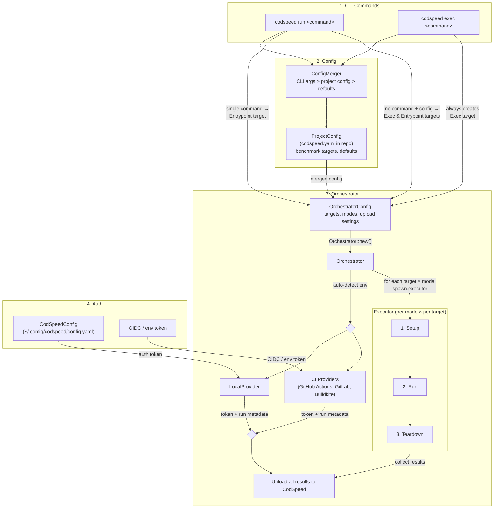

# Architecture

## Execution flow

This diagram shows how the CLI commands, project config, orchestrator (with providers), and executors interact during a benchmark run.

### Key interactions

- **CLI → Config**: Both `run` and `exec` merge CLI args with `ProjectConfig` (CLI takes precedence). `run` can source targets from project config; `exec` always creates an `Exec` target.
- **CLI → Orchestrator**: The merged config becomes an `OrchestratorConfig` holding all targets and modes.
- **Orchestrator → Providers**: Auto-detects environment (Local vs CI). Local uses the auth token from `CodSpeedConfig`; CI providers handle OIDC tokens.
- **Orchestrator → Executors**: Groups all `Exec` targets into one exec-harness pipe command, runs each `Entrypoint` independently. For each target group, iterates over all modes, creating an `ExecutionContext` per mode and dispatching to the matching executor (`Valgrind`/`WallTime`/`Memory`). After all runs complete, uploads results with provider metadata.
